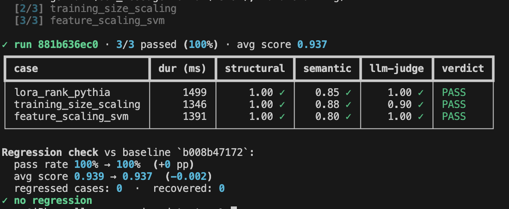

# 🛡️ LLM Regression Detector

> CI/CD for LLM behavior. Take any LLM-powered feature, run a golden dataset against it on every prompt or model change, score the outputs, and fire an alert when quality drops below threshold.

LLM apps silently regress when prompts or models change — and you only find out when users complain. This treats prompts and models like code: every change runs against a golden dataset and surfaces regressions before they ship.

## Screenshots

<p align="center">
  <br/>
  <br/>
  <br/>
  <br/>
  
</p>

## Status

**Phase 1 — engine** ✅ shipped: golden YAML schema · 3 scoring methods (structural / semantic / LLM-judge) · DuckDB run store · CLI.

| Phase | What it adds | State |
|---|---|---|
| 1 | Engine (runner, scorers, store, CLI) | ✅ |
| 2 | Regression detector + Slack alerts (simulated) | next |
| 3 | Streamlit dashboard (history · diff · charts) | — |
| 4 | GitHub Actions integration (PR-comment bot) | — |
| 5 | Polish + recorded demo | — |

## Quick start

```bash
make install                    # creates .venv, installs deps + dashboard extras
cp .env.example .env            # then add GROQ_API_KEY + GOOGLE_API_KEY

make run                        # runs the example golden set against ml-research-agent's planner
```

The `make run` command:
1. Loads `examples/golden_planner.yaml` (3 research questions with expected criteria)
2. Calls **ml-research-agent's planner** for each (the *system under test*)
3. Scores each output **3 ways**: structural rules · semantic similarity vs `expected` · Gemini-as-judge
4. Persists everything to `runs.duckdb`
5. Prints a per-case verdict table

## Other commands

```bash
lrd runs                        # list recent runs
lrd diff <run_a> <run_b>        # case-by-case diff between two runs
                                # (highlights regressions: pass → fail flips)
```

## Stack

- **Groq Llama 3.3 70B** — the LLM under test (drives ml-research-agent's planner)
- **Gemini 2.0 Flash** — LLM-as-judge scorer
- **Gemini text-embedding-004** — semantic similarity scorer
- **DuckDB** — analytics-friendly run store (SQL queryable, file-backed, no daemon)
- **Typer + Rich** — CLI
- **Streamlit + Plotly** (Phase 3) — dashboard

All free. Runs on a Mac. No GPU.

## How a golden case is structured

```yaml
- id: lora_rank_pythia
  input: "Does LoRA rank (8 vs 64) affect GSM8K accuracy on Pythia-160M?"
  expected: |
    A concrete experimental plan with hypothesis, numbered method, named
    metrics, and a runtime estimate. Should mention Pythia-160M, GSM8K, LoRA.
  scoring:
    - method: structural
      threshold: 1.0
      rules:
        - regex: '\*\*Hypothesis\*\*'
        - contains: pythia
    - method: semantic_sim
      threshold: 0.40
    - method: llm_judge
      threshold: 0.6
      rubric: "Score 0-1: is this a concrete, runnable ML experimental plan?"
```

## Project layout

```
llm-regression-detector/
├── examples/golden_planner.yaml      # sample golden set
├── src/lrd/
│   ├── golden.py                     # YAML schema + loader
│   ├── runner.py                     # orchestrator
│   ├── cli.py                        # `lrd` Typer CLI
│   ├── sut/
│   │   ├── base.py                   # SUT protocol
│   │   └── mlra_planner.py           # adapter → ml-research-agent's planner
│   ├── scoring/
│   │   ├── structural.py             # regex / contains / length
│   │   ├── semantic_sim.py           # Gemini embeddings + cosine
│   │   └── llm_judge.py              # Gemini Flash as judge
│   └── store/
│       └── duckdb_store.py           # runs / results / scores schema
└── tests/unit/                       # offline unit tests
```
